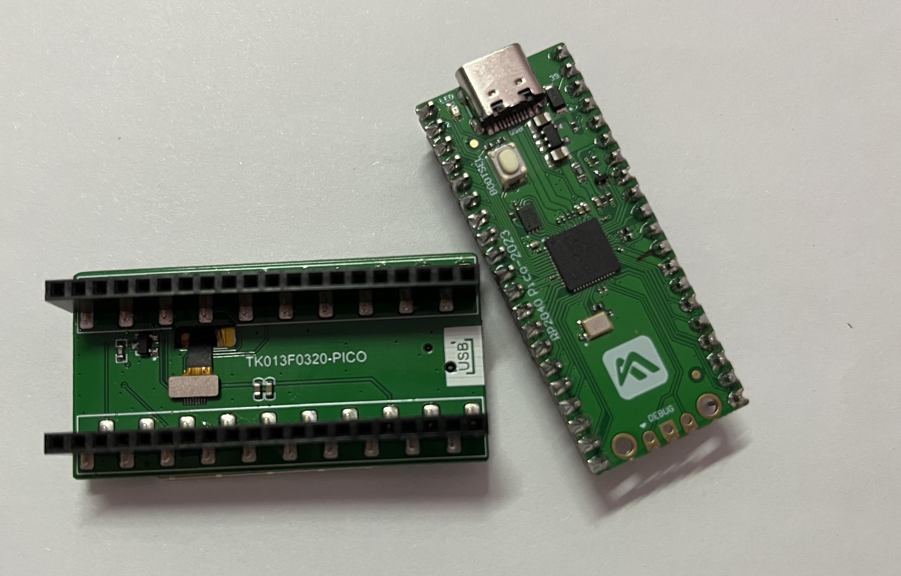
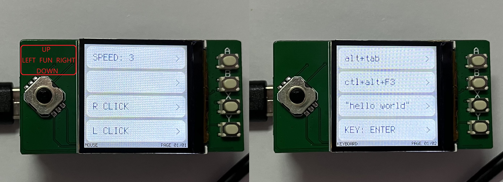
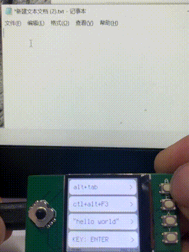
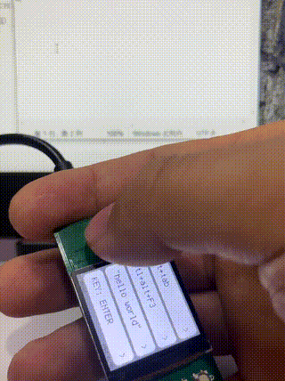

# Pico_TKXX_HID

Raspberry Pi uses the peripheral board tkxx (st7789+button) to simulate HID keyboard and mouse devices.

中文 | [ENGLISH](README_EN.md) 

使用树莓派PICO与TK013F0320-PICO外设电路板模拟HID键鼠.

**具有两种模式, 鼠标模式与键盘模式:**

* 键盘模式是开机默认的模式
* 按**FUN**键切换**键盘**与**鼠标**模式

**键盘模式**

* 当载入项目大于一页时, 使用方向键翻页

* 使用ABXY键选择执行对应的功能

* 可以模拟键盘按键的按压和释放, 或者连续输入一串字符

* 在[user_kbd.py](https://github.com/skkily/Pico_TKXX_HID/blob/main/user_kbd.py)中可以添加更多的功能项目

  

**鼠标模式**

* 使用方向键移动光标

* A: 用于调整光标的速度

* B: 无功能

* X: 鼠标右键

* Y: 鼠标左键

  

**如何使用**:

1. 安装circuitPython到树莓派Pico

   [点此下载](https://circuitpython.org/board/raspberry_pi_pico/) 下载8.x版本

2. 按住Pico的BOOTSEL键连接数据线, 吧下载的adafruit-circuitpython-raspberry_pi_pico-en_US-8.2.9.uf2.复制到出现的RPI-RP2磁盘中.
4. 吧本项目release压缩包解压到出现的CIRCUITPY磁盘中, 并删除其中的code.py, 完成.
