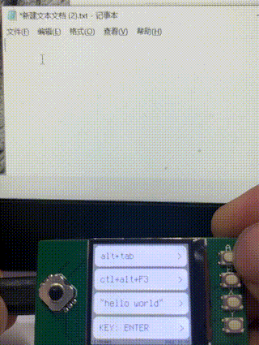
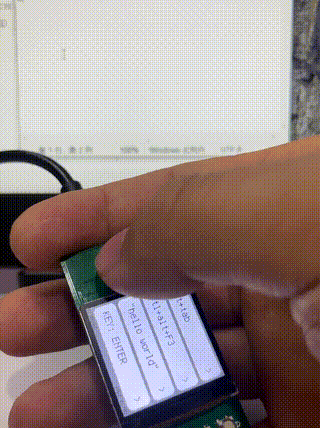

# Pico_TKXX_HID

Raspberry Pi uses the peripheral board tkxx (st7789+button) to simulate HID keyboard and mouse devices.

[中文](README.md) | ENGLISH

**Has two modes, mouse mode and keyboard mode:**

* Keyboard mode is the default mode at startup
* Press the **FUN** key to switch between **keyboard** and **mouse** modes

* **Keyboard Mode**

  * When the loaded item is larger than one page, use the arrow keys to turn pages

  * Use the ABXY keys to select and execute the corresponding function

  * Can simulate the pressing and releasing of keyboard keys, or continuously enter a string of characters

  * More functional projects can be added in [user_kbd.py](https://github.com/skkily/Pico_TKXX_HID/blob/main/user_kbd.py)

  

* **Mouse Mode**

  * Use the arrow keys to move the cursor

  * A: Used to adjust the cursor speed

  * B: No function

  * X: Right mouse button

  * Y: left mouse button

  

**how to use**:

1. Install circuitPython to Raspberry Pi Pico

    [Click here to download](https://circuitpython.org/board/raspberry_pi_pico/) Download version 8.x

2. Press and hold Pico's **BOOTSEL button** to connect the usb cable, and copy the downloaded adafruit-circuitpython-raspberry_pi_pico-en_US-8.2.9.uf2 to the **RPI-RP2 disk** that appears.

3. Unzip the release compressed package of this project to the **CIRCUITPY disk** that appears, and complete.

